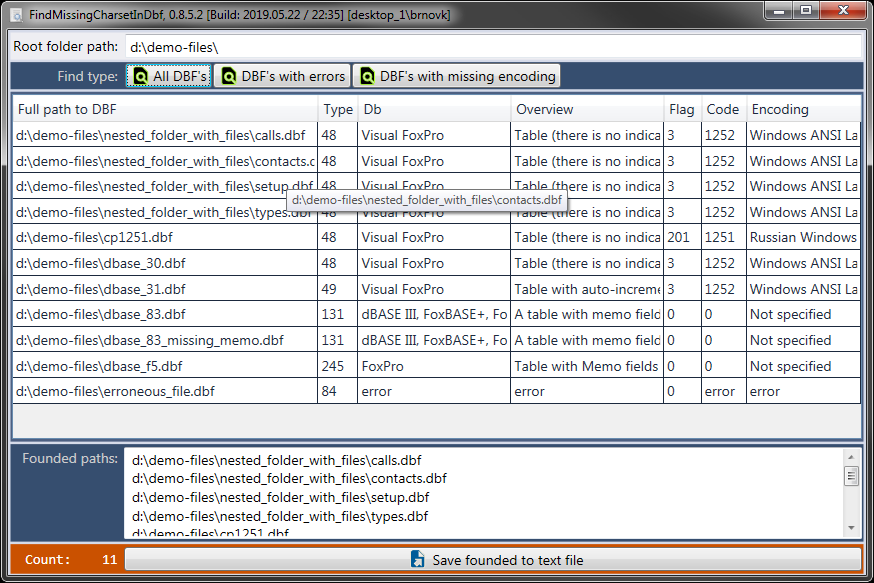

# FindMissingCharsetInDbf

A utility to search for faulty DBF and missing-coded files. Supports nested encodings. Doesn't fall when searching for directories that you don't have access to.

## Demonstration screenshots:

  